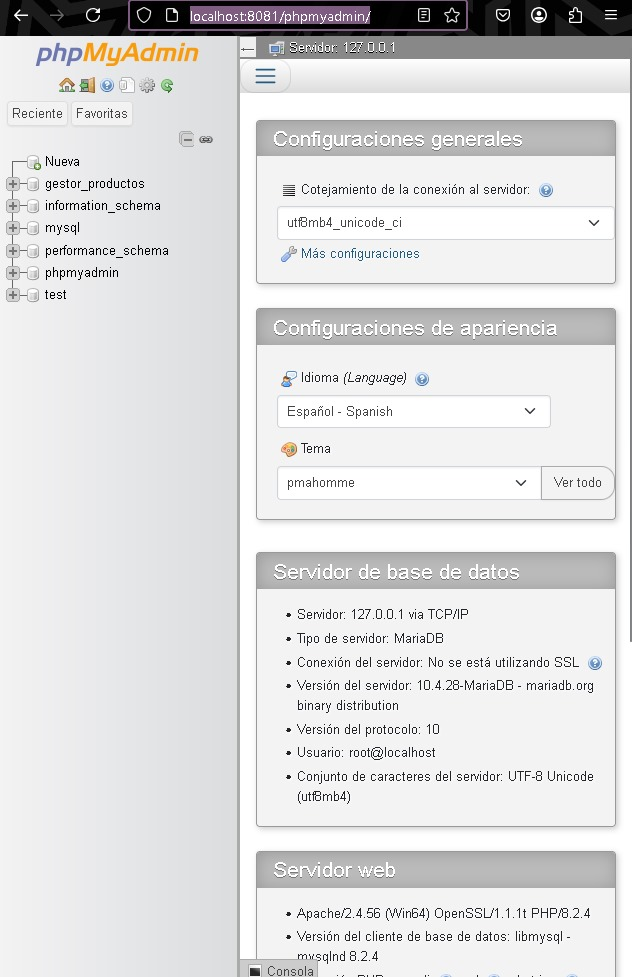

# Gestor de Productos

Este es un proyecto FullStack con PHP y JavaScript que permite gestionar productos en una base de datos MySQL.  

## 🛠 Tecnologías utilizadas
- PHP
- MySQL
- JavaScript
- jQuery
- HTML5 y CSS3
- Git
- JSON y XML
- API REST
- PHPUnit
- GitHub Actions

## 🚀 Instalación
1. Clona el repositorio:
   ```sh
   git clone https://github.com/dobaldev/Gestor_de_Productos.git
2. Configura la base de datos en config/database.php.
3. Importa el archivo db/database.sql en MySQL.
4. Inicia un servidor local con XAMPP o ejecuta:
php -S localhost:8000 -t public
5. Abre en el navegador:
http://localhost:8081/phpmyadmin

📌 Funcionalidades

- ✅ Agregar, editar y eliminar productos.
- ✅ Interfaz dinámica con AJAX y jQuery.
- ✅ Consumo de API REST en JSON/XML.
- ✅ Seguridad con protección contra CSRF y validaciones.
- ✅ Pruebas automatizadas con PHPUnit.

🏗 Futuras Mejoras

    Autenticación con JWT.
    Integración con Laravel.
    Implementación de Docker.
